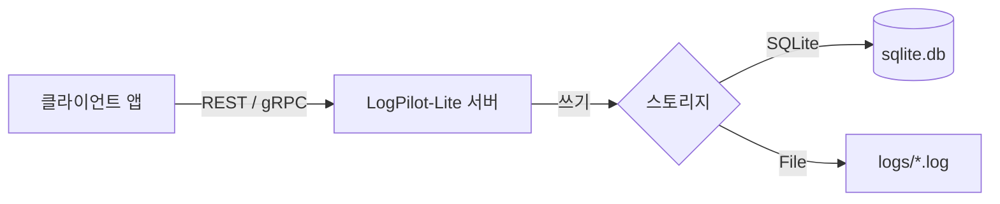

# LogPilot-Lite 🛩️

🛩️ **LogPilot-Lite**는 **경량 클라우드 네이티브 이벤트 스트리밍 브로커**입니다.

이 프로젝트는 [LogPilot](https://github.com/danpung2/LogPilot)의 독립형(Standalone) 대안으로, 분산 시스템의 복잡성 없이 단순한 단일 바이너리 솔루션을 필요로 하는 개인 개발자나 소규모 팀을 위해 설계되었습니다.

## 왜 LogPilot-Lite인가요?

Kafka와 같은 기존 이벤트 스트리밍 플랫폼이나 LogPilot의 풀 버전조차도 소규모 프로젝트에는 과도할 수 있습니다. **LogPilot-Lite**는 핵심 기능은 유지하면서 패키지를 획기적으로 단순화했습니다.

| 특징 | LogPilot 🛡️ | LogPilot-Lite 🛩️ |
|---------|------------|------------------|
| **기술 스택** | Java (Spring Boot) | Node.js (TypeScript) |
| **규모** | 중소형 / 분산 환경 | 소형 / 단일 노드 |
| **프로젝트 구조** | 멀티 모듈 (Gradle) | 모노레포 (npm workspaces) |
| **배포** | Kubernetes / 멀티 컨테이너 | 단일 Docker 컨테이너 / 프로세스 |

## 🚀 주요 기능

- **이벤트 스트리밍 엔진**: 고성능 **gRPC (50051)** 및 **REST API (8080)** 듀얼 프로토콜 지원.
- **경량 설계**: 단일 프로세스로 실행됩니다. 외부 데이터베이스가 필요 없습니다 (내장 SQLite(기본값) 또는 파일 시스템 사용).
- **의존성 제로**: ZooKeeper나 복잡한 설정이 필요 없습니다. 실행하고 바로 스트리밍하세요.
- **오프셋 관리**: **Consumer Group**을 지원하여 안정적인 메시지 전달과 이어받기(Resume) 기능을 보장합니다.
- **클라이언트 SDK**: 쉬운 연동을 위한 [TypeScript 클라이언트](./logpilot-lite-client/README.ko.md)가 내장되어 있습니다.

## 📐 아키텍처



## 🏃 빠른 시작 (Quick Start)

### Docker (추천)

Docker를 사용해 즉시 서버를 실행할 수 있습니다.

```bash
# 이미지 다운로드
docker pull danpung2/logpilot-lite:latest

# REST 모드 실행 (기본값)
docker run -d -p 8080:8080 \
  -e LOGPILOT_MODE=rest \
  -v $(pwd)/data:/data \
  danpung2/logpilot-lite:latest

# gRPC 모드 실행
docker run -d -p 50051:50051 \
  -e LOGPILOT_MODE=grpc \
  -v $(pwd)/data:/data \
  danpung2/logpilot-lite:latest
```

### Node.js (직접 실행)

로컬 머신에서 직접 실행하고 싶다면 다음을 참고하세요:

**필수 조건**: Node.js **20 버전 이상**

```bash
# 의존성 설치
npm install

# REST 서버 시작
npm run dev:rest

# gRPC 서버 시작
npm run dev:grpc
```

## 🔧 문제 해결 (Troubleshooting)

### `better-sqlite3` 빌드 문제

로컬에서 실행 시 `NODE_MODULE_VERSION` 또는 `better-sqlite3` 관련 에러가 발생한다면, 의존성 설치 시점의 Node.js 버전과 실행 시점의 버전이 달라서 발생하는 문제입니다.

**해결 방법:**
```bash
# 네이티브 모듈 재빌드
npm rebuild better-sqlite3
```
또는 모든 의존성이 관리되는 **Docker** 방식을 사용하는 것을 권장합니다.

## ⚙️ 설정 (Configuration)

환경 변수를 통해 서버를 설정할 수 있습니다.

| 변수명 | 설명 | 기본값 |
|----------|-------------|---------|
| `LOGPILOT_MODE` | 서버 실행 모드 (`rest` 또는 `grpc`) | `rest` |
| `PORT` | REST 서버 포트 | `8080` |
| `LOGPILOT_DB_PATH` | SQLite 데이터베이스 파일 경로 | `./data/logpilot.db` |
| `LOGPILOT_STORAGE_DIR`| 파일 기반 로그 저장 디렉토리 (파일 모드 사용 시) | `./storage` |

## 📡 API 레퍼런스

### REST API

#### 1. 로그 전송 (Send Log)
새로운 로그 엔트리를 전송합니다.
`POST /api/logs`

```json
{
  "channel": "payment",
  "level": "INFO",
  "message": "Payment processed"
  // "storage": "sqlite" (기본값)
}
```

#### 2. 로그 조회 (Fetch Logs)
오프셋 트래킹과 함께 로그를 조회합니다.
`GET /api/logs`

**쿼리 파라미터:**
- `channel` (필수): 조회할 로그 채널.
- `since`: 조회 시작 ID 또는 타임스탬프.
- `limit`: 최대 반환 로그 수 (기본값 100).
- `consumerId`: 제공 시, 서버가 읽은 오프셋을 자동으로 추적합니다.

```bash
curl "http://localhost:8080/api/logs?channel=payment&consumerId=my-app"
```

#### 3. 오프셋 초기화 (Seek Offset)
컨슈머의 오프셋을 수동으로 재설정합니다.
`POST /api/logs/seek`

```json
{
  "channel": "payment",
  "consumerId": "my-app",
  "operation": "EARLIEST" 
}
```
*(오퍼레이션: `EARLIEST`, `LATEST`, `SPECIFIC`)*

## 🔌 클라이언트 SDK

gRPC 통신을 위한 전용 TypeScript 클라이언트를 제공합니다.

👉 **[LogPilot-Lite 클라이언트 문서 바로가기](./logpilot-lite-client/README.ko.md)**

## 📄 라이선스 (License)

MIT License. 상세 내용은 [LICENSE](./LICENSE) 파일을 확인하세요.
