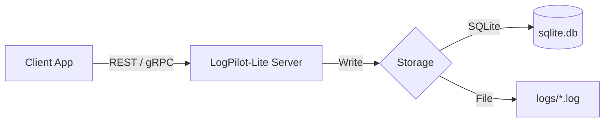

# LogPilot-Lite 🛩️

🛩️ **LogPilot-Lite** is a **LogPilot-Lite is a lightweight, cloud-native Event Streaming Broker**.

It is designed as a standalone alternative to [LogPilot](https://github.com/danpung2/LogPilot) for individual developers or small teams who need a simple, single-binary solution without the complexity of a distributed system.

## Why LogPilot-Lite?

Traditional event streaming platforms (like Kafka) and even full-featured versions of LogPilot can be overkill for smaller projects. **LogPilot-Lite** offers similar core capabilities but in a radically simplified package.

| Feature | LogPilot 🛡️ | LogPilot-Lite 🛩️ |
|---------|------------|------------------|
| **Core** | Java (Spring Boot) | Node.js (TypeScript) |
| **Scale** | Medium-Scale / Distributed | Small-Scale / Single Node |
| **Project Structure** | Multi-Module (Gradle) | Monorepo (npm workspaces) |
| **Storage** | Pluggable Drivers (MySQL, etc.) | SQLite (Default) / File System |
| **Deployment** | Kubernetes / Multi-Container | Single Docker Container / Process |

## 🚀 Key Features

- **Event Streaming Engine**: Dual protocol support with high-performance **gRPC (50051)** and **REST API (8080)**.
- **Lightweight by Design**: Runs as a single process. No external database required (uses embedded SQLite or File System).
- **Zero-Dependency**: No ZooKeeper, no complex setup. Just run and stream.
- **Offset Management**: Supports **Consumer Groups** to ensure reliable message delivery and resume capability.
- **Client SDK**: Built-in [Game-ready TypeScript Client](./logpilot-lite-client/README.md) for easy integration.

## 📐 Architecture



## 🏃 Quick Start

### Docker (Recommended)

Run the server instantly using Docker.

```bash
# Pull the image
docker pull danpung2/logpilot-lite:latest

# Run REST Mode (Default)
docker run -d -p 8080:8080 \
  -e LOGPILOT_MODE=rest \
  -v $(pwd)/data:/data \
  danpung2/logpilot-lite:latest

# Run gRPC Mode
docker run -d -p 50051:50051 \
  -e LOGPILOT_MODE=grpc \
  -v $(pwd)/data:/data \
  danpung2/logpilot-lite:latest
```

### Node.js (Metal)

If you prefer running directly on your machine:

**Prerequisites**: Node.js **20+**

```bash
# Install dependencies
npm install

# Start REST Server
npm run dev:rest

# Start gRPC Server
npm run dev:grpc
```

## 🔧 Troubleshooting

### `better-sqlite3` Build Issues

If you encounter errors related to `NODE_MODULE_VERSION` or `better-sqlite3` when running locally, it is usually due to a mismatch between the Node.js version used to install dependencies and the one used to run the app.

**Solution:**
```bash
# Rebuild native modules
npm rebuild better-sqlite3
```
Or simply use the **Docker** method, which handles all dependencies for you.

## ⚙️ Configuration

Configure the server using environment variables.

| Variable | Description | Default |
|----------|-------------|---------|
| `LOGPILOT_MODE` | Server mode (`rest` or `grpc`) | `rest` |
| `PORT` | HTTP Port for REST server | `8080` |
| `LOGPILOT_DB_PATH` | Path to SQLite database file | `./data/logpilot.db` |
| `LOGPILOT_STORAGE_DIR`| Directory for file-based logs (if used) | `./storage` |

## 📡 API Reference

### REST API

#### 1. Send Log
Push a new log entry.
`POST /api/logs`

```json
{
  "channel": "payment",
  "level": "INFO",
  "message": "Payment processed"
  // "storage": "sqlite" (Default)
}
```

#### 2. Fetch Logs
Retrieve logs with offset tracking.
`GET /api/logs`

**Query Parameters:**
- `channel` (Required): Log channel to read from.
- `since`: Timestamp or ID to start reading from.
- `limit`: Max logs to return (default 100).
- `consumerId`: If provided, the server tracks your read offset automatically.

```bash
curl "http://localhost:8080/api/logs?channel=payment&consumerId=my-app"
```

#### 3. Seek Offset
Manually reset the offset for a consumer.
`POST /api/logs/seek`

```json
{
  "channel": "payment",
  "consumerId": "my-app",
  "operation": "EARLIEST" 
}
```
*(Operations: `EARLIEST`, `LATEST`, `SPECIFIC`)*

## 🔌 Client SDK

We provide a dedicated TypeScript client for gRPC.

👉 **[Go to LogPilot-Lite Client Documentation](./logpilot-lite-client/README.md)**

## 📄 License

MIT License. See [LICENSE](./LICENSE) for details.
